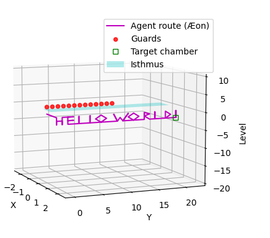

# Isthmus Cyclicus Crypticus

[Isthmus Cyclicus Crypticus](https://esolangs.org/wiki/Isthmus_Cyclicus_Crypticus) is an experimental thematic esoteric programming language, inspired by the episode [*Isthmus Crypticus*](https://aeonflux.fandom.com/wiki/Isthmus_Crypticus) of the animated series [Æon Flux](https://wikipedia.org/wiki/Æon_Flux).

As a language it is basically a combination 3D Turtle graphics, cyclic tag system, game level-design, and narrative generator.


## Overview
An agent infiltrates a Crypticus complex in search of a particular goal containing chamber, guided by instructions written in the ancient language of Scaloti Middle-High Breen, translated on the fly by an assistant. The mission ends once the chamber is reached, or aborted if the enemy guards overrun the complex, by advancing across the aerial bridge (the isthmus) that passes through the giant central chamber of the Crypticus complex. If guards detect traces of the agent's passing at any level across the central chamber when they advance, they go into high alert. The translating agent is then unable to relay instructions (skips a section) and must instruct the active agent to wait while she catches up and finds her place in text. If the translator reaches the end of the text before the mission is over, she begins again at the beginning (hence Cyclicus).


## Syntax

Source code is written in a reduced set of symbols that approximate those used in the original episode for the coded directions to the goal chamber. For the purposes of this language they can be referred to as Scaloti Abbreviated-Low Breen.

Main directional symbols are taken from the Unicode block [Unified Canadian Aboriginal Syllabics](https://wikipedia.org/wiki/Unified_Canadian_Aboriginal_Syllabics_(Unicode_block)), and have the property that they rotate and reflect, and look very much like the symbols used to represent Scaloti Middle-High Breen in the episode.

Numerals are a combination of [Telegu](https://wikipedia.org/wiki/Telugu_script#Numerals) (even) and [Odia](https://wikipedia.org/wiki/Odia_script#Numerals) (odd) numerals ౦୧౨୩౪୫౬୭౮୯. (*Reason:* avoid Telugu 3, which looks too much like a '3', and avoid Odia 8, which could be confused for a Canadian Aboriginal Mi, used here for Right turn).

Tifinagh symbols are to be used for adding detail to the narration and level, they do not add any to the computational power, but could be utilised for output encoding.

## Command list
A full command list can be found in [commands.md](commands.md).


## Example
[Hello, World!](examples/hello-world.icc)

```
ᐁ
ᐁ
ᑌᑌᒋᐅᑌᒋᑎᐅ
ᐅᒋᑌᐅᒋᑌᐅᐅ
ᑎᑎᒋᑊᐅᐅ
ᑎᑎᒋᑊᐅᐅ
ᑎᐸᑎᐳᑌᐳᑌᐸᐅᐅ
ᐅᑎᑭᑭᐸᑊᒋᑊᑎᑭᐳᑌᑯᐳᑎᑭᐳᑊᒋᑊᐅᐅ
ᑎᐸᑎᐳᑌᐳᑌᐸᐅᐅ
ᑎᑎᑌᐳᐳᑌᐸᐸᑌᐳᐅ
ᑎᑎᒋᑊᐅᐅ
ᑎᑎᑌᐳᑌᐸᐅ
ᐅᑎᑎᒋᑊ
ᕽ
```

## Output
Output is provided in the form of:

1. An English transcript of the instructions relayed to the active agent by the translator.
2. A 3D plot of the active agent through a Crypticus Complex, including all the positions occupied by the guards.

### Hello, World! transcript

(current, rather than final form:)

```
    { The guards crossing the isthmus above are on high alert! }
Una: Wait...
Una: Ok, it's safe to move! Go south.
Æon: Green light, go.
     Red light, stop.
     Green light, stop.
     Red light, go!
Una: Go down. Go down. Take the switchback. Go east. Go down. Take the switchback. Go up. Go east.
Una: Go east. Take the switchback. Go down. Go east. Take the switchback. Go down. Go east. Go east.
Una: Go up. Go up. Take the switchback. Press on. Go east. Go east.
Una: Go up. Go up. Take the switchback. Press on. Go east. Go east.
Una: Ascend westward. Ascend eastward. Descend eastward. Descend westward. Go east. Go east.
Una: Go east. Ascend steeply up-westward. Press on. Take the switchback. Press on. Ascend steeply eastward. Descend steeply eastward. Ascend steeply eastward. Press on. Take the switchback. Press on. Go east. Go east.
Una: Ascend westward. Ascend eastward. Descend eastward. Descend westward. Go east. Go east.
Una: Go up. Go up. Descend east-eastward. Descend west-westward. Descend eastward. Go east.
Una: Go up. Go up. Take the switchback. Press on. Go east. Go east.
Una: Go up. Go up. Descend eastward. Descend westward. Go east.
Una: Go east. Go up. Go up. Take the switchback. Press on.
Una: You should be able to see a red door to your right... with a green frame.

Mission successfully completed after 13 passages.
```

### Hello, World! graphical plot



